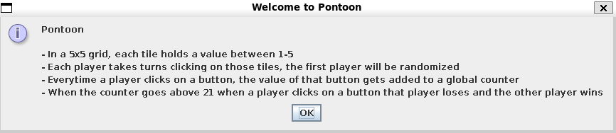
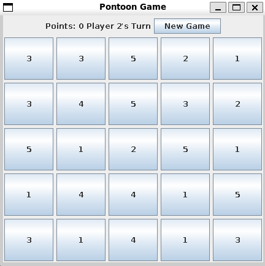

# Pontoon

| Name | Student Number |
|----------|----------|
| Fadhil Revinno Hairiman    | 202514421   |

## How to Run
- Move to the `draft1` directory
- Open up terminal (unix/linux/mac)
- Enter the command `javac Pontoon.java` to compile 

- Enter the command `java Pontoon` to run

- Once the last command has been entered, pontoon should be loaded

## Requirements
### Functions

#### **startGame()**
Activates when users click on the start game button.

#### **switchPlayers()**
Activates when player x clicks on one of the button tiles.

#### **pointsCount()**
Activates when player x clicks on one of the button tiles. Adds value from each button to a global counter which will be used in checkWinner() function to determine the winners.

#### **checkWinner()**
Activates when player x clicks on one of the button tiles. Checks the total points and compares it with the player. If it is player x's turn and the global point goes over 21, player x loses. If player x loses, then print player y wins. 

### Objects
- Game
- Players

### Pseudocode
1. Player clicks start game, activates startGame() function
2. Game initializes, starts off from player 1. Use while loop, unless when winner is found then dispaly the winner in the GUI and end the while loop terminating the game. Player one presses one of the buttons which triggers:
- startGame() function
- pointsCount() function
- checkWinner() function
- switchPlayers() function
3. Iterates process until checkWinner() condition is fulfilled
4. Game Over

## References
- https://www.youtube.com/watch?v=Kmgo00avvEw&t=3535s&pp=ygUZYnJvIGNvZGUgc3dpbmcgY29tcG9uZW50cw%3D%3D