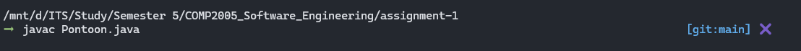

# Pontoon

## How to Run
- Move to the assignment-1 directory
- Open up terminal (unix/linux/mac)
- Enter the command `javac Pontoon.java` to compile 

- Enter the command `java Pontoon` to run

- Once the last command has been entered, pontoon should be loaded

